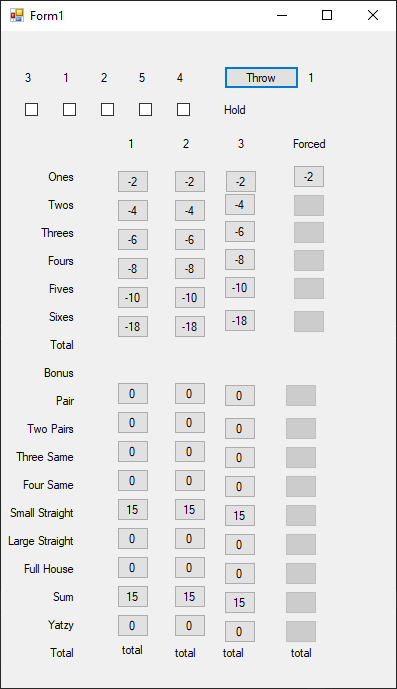

# long-yatzi
Game similar, but different to Yahtzee. Goal of this project is to adapt the game for Android. At the moment the game ui is only windows forms based.\
The game can now be played and had some fun with, if you like this sort of thing.

Features working:\
-Dice throwing\
-Holding/locking dice between throws\
-score keeping. High scores aren't saved anywhere, so pen and paper is still needed if you want to remember your high scores!\
-Single player mechanics

Work in progress:\
-windows forms based UI

Todo:\
-write coherent instructions\
-local high score table\
-android implementation\
-local multiplayer\
-online multiplayer

The game consists of 60 turns per player. Player can throw dice maximum of 3 times per turn.
Before second and third throw player can hold dice they want to keep.
When the player is happy with the dice (or out of throws) player has to mark the score in a suitable category.
If the dice don't add to a score in any category, the player has to discard a suitable category of their choice. 
In the end scores from all the categories are added together and winner is the player with most points.

